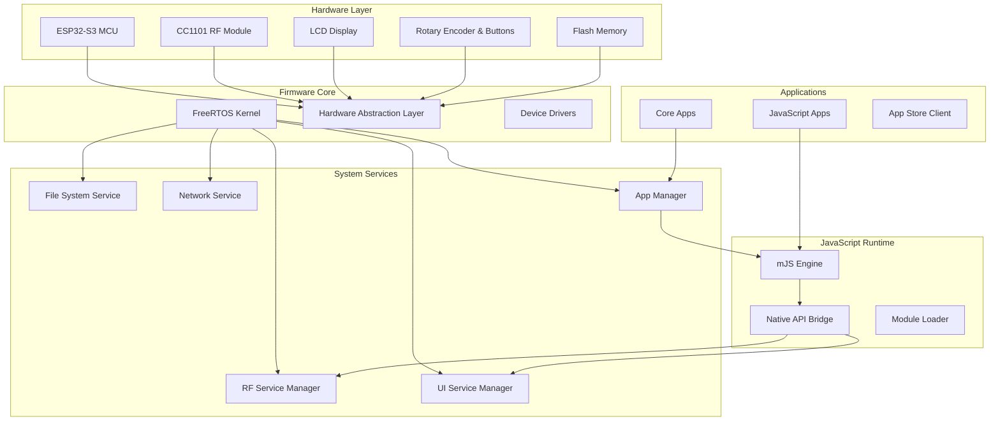
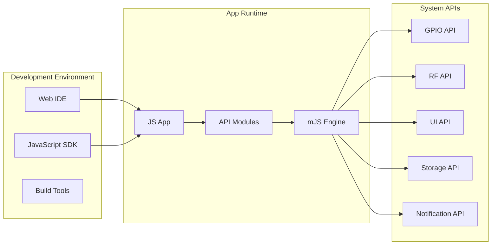
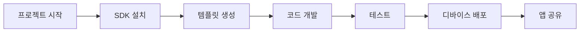

# LilyGO T-Embed CC1101 JavaScript 앱 지원 펌웨어 설계

## 개요

LilyGO T-Embed CC1101을 위한 펌웨어로, 기존 CC1101의 기본 기능을 유지하면서 Flipper Zero와 유사한 JavaScript 기반 앱 개발 환경을 제공합니다. ESP32-S3 기반의 T-Embed 하드웨어에서 Sub-GHz 통신 기능과 JavaScript 런타임을 통합하여 확장 가능한 앱 생태계를 구축합니다.

### 목표
- CC1101의 기본 Sub-GHz 기능 완전 지원
- Flipper Zero 스타일의 JavaScript 앱 개발 환경 제공
- 직관적인 UI/UX와 앱 관리 시스템
- 개발자 친화적인 SDK 및 도구 체인

### 주요 특징
- Sub-GHz 송수신 (315MHz, 433MHz, 868MHz, 915MHz)
- JavaScript 엔진 내장 (mJS 기반)
- 모듈화된 하드웨어 접근 API
- 실시간 앱 로딩 및 실행
- 웹 기반 IDE 지원

## 기술 스택

### 하드웨어 플랫폼
- **MCU**: ESP32-S3 (240MHz, Xtensa 아키텍처)
- **RF 모듈**: CC1101 Sub-GHz 트랜시버
- **디스플레이**: 1.9" LCD (170x320)
- **저장소**: 16MB Flash, 8MB PSRAM
- **연결성**: Wi-Fi, Bluetooth, USB-C
- **입력**: 로터리 엔코더, 버튼

### 소프트웨어 스택
- **OS**: FreeRTOS 기반 커스텀 펌웨어
- **JavaScript 엔진**: mJS (Mongoose JavaScript)
- **UI 프레임워크**: LVGL (Light and Versatile Graphics Library)
- **네트워킹**: ESP-IDF Wi-Fi/Bluetooth 스택
- **파일 시스템**: SPIFFS/LittleFS

## 아키텍처

### 시스템 아키텍처



### JavaScript 앱 아키텍처



## 핵심 컴포넌트

### 1. RF Service Manager

CC1101 하드웨어를 추상화하여 JavaScript 앱에서 Sub-GHz 통신을 쉽게 사용할 수 있도록 지원

**주요 기능:**
- 주파수 설정 및 변조 방식 선택
- 송신/수신 버퍼 관리
- 프로토콜 디코딩/인코딩
- 신호 분석 및 스펙트럼 뷰

**API 인터페이스:**
```javascript
// 주파수 설정
rf.setFrequency(433920000); // 433.92 MHz

// 신호 수신
rf.receive((data) => {
    console.log("Received:", data.payload);
});

// 신호 송신
rf.transmit({
    frequency: 433920000,
    modulation: "ASK_OOK",
    payload: [0x12, 0x34, 0x56, 0x78]
});
```

### 2. JavaScript Engine (mJS)

경량화된 JavaScript 런타임으로 실시간 앱 실행 지원

**특징:**
- 메모리 효율적인 실행 환경
- 실시간 코드 로딩
- 네이티브 API 바인딩
- 에러 핸들링 및 디버깅 지원

**지원 기능:**
- ES5 JavaScript 문법
- 모듈 시스템 (require/import)
- 비동기 프로그래밍 (setTimeout, setInterval)
- 이벤트 기반 프로그래밍

### 3. UI Service Manager

LVGL 기반의 그래픽 사용자 인터페이스 관리

**컴포넌트:**
- 메인 메뉴 시스템
- 앱 런처
- 설정 화면
- 상태 표시줄

**JavaScript UI API:**
```javascript
// 화면 생성
const screen = ui.createScreen();

// 버튼 추가
const button = ui.button({
    text: "Send Signal",
    x: 10, y: 50,
    width: 100, height: 40
});

button.onClick(() => {
    rf.transmit(signalData);
});
```

### 4. App Manager

JavaScript 앱의 생명주기 관리 및 샌드박스 환경 제공

**기능:**
- 앱 설치/제거
- 권한 관리
- 리소스 할당 제한
- 멀티태스킹 지원

## JavaScript API 모듈

### 1. RF 모듈 (`@cc1101/rf`)

```javascript
import * as rf from "@cc1101/rf";

// 설정
rf.configure({
    frequency: 433920000,
    modulation: "ASK_OOK",
    dataRate: 4800,
    bandwidth: 58000
});

// 수신 모드
rf.startReceive((signal) => {
    console.log("Frequency:", signal.frequency);
    console.log("RSSI:", signal.rssi);
    console.log("Data:", signal.data);
});

// 송신
rf.transmit(dataArray);
rf.stopReceive();
```

### 2. GPIO 모듈 (`@cc1101/gpio`)

```javascript
import * as gpio from "@cc1101/gpio";

// 핀 설정
gpio.setup(2, "output");
gpio.setup(3, "input_pullup");

// 디지털 I/O
gpio.write(2, true);
const state = gpio.read(3);

// 인터럽트
gpio.attachInterrupt(3, "falling", () => {
    console.log("Button pressed!");
});
```

### 3. UI 모듈 (`@cc1101/ui`)

```javascript
import * as ui from "@cc1101/ui";

// 메인 화면
const screen = ui.createScreen();
ui.setActiveScreen(screen);

// 위젯 생성
const label = ui.label({
    text: "CC1101 Scanner",
    align: "center"
});

const list = ui.list();
list.addItem("433.92 MHz");
list.addItem("315.00 MHz");

list.onSelect((index) => {
    console.log("Selected:", index);
});
```

### 4. Storage 모듈 (`@cc1101/storage`)

```javascript
import * as storage from "@cc1101/storage";

// 파일 작업
storage.writeText("/apps/data.txt", "Hello World");
const content = storage.readText("/apps/data.txt");

// 설정 저장
storage.setConfig("frequency", 433920000);
const freq = storage.getConfig("frequency", 433920000);

// 디렉토리 작업
const files = storage.listFiles("/apps");
```

### 5. Notification 모듈 (`@cc1101/notification`)

```javascript
import * as notify from "@cc1101/notification";

// LED 제어
notify.led({
    color: "blue",
    duration: 1000
});

// 진동
notify.vibrate(500);

// 비프음
notify.beep({
    frequency: 1000,
    duration: 200
});

// 알림 메시지
notify.show({
    title: "Signal Received",
    message: "433.92 MHz detected",
    timeout: 3000
});
```

## 앱 개발 워크플로우

### 1. 개발 환경 설정



### 2. 프로젝트 구조

```
my-cc1101-app/
├── package.json
├── cc1101.config.json
├── src/
│   ├── index.js          # 메인 앱 파일
│   ├── components/       # UI 컴포넌트
│   ├── utils/           # 유틸리티 함수
│   └── assets/          # 리소스 파일
├── dist/                # 빌드 출력
└── docs/               # 문서
```

### 3. 개발 도구

**SDK 설치:**
```bash
npm install -g @cc1101/sdk
cc1101 create my-app
cd my-app
npm install
```

**개발 서버:**
```bash
npm run dev        # 실시간 개발 모드
npm run build      # 프로덕션 빌드
npm run deploy     # 디바이스 배포
```

## 보안 및 권한 관리

### 앱 샌드박스

각 JavaScript 앱은 격리된 환경에서 실행되며 제한된 권한을 가집니다.

**권한 레벨:**
- **Basic**: UI, Storage 접근
- **Hardware**: GPIO, RF 접근 
- **System**: 시스템 설정 변경
- **Network**: Wi-Fi, Bluetooth 접근

**권한 선언 (package.json):**
```json
{
  "name": "rf-scanner",
  "version": "1.0.0",
  "permissions": [
    "rf.receive",
    "rf.transmit", 
    "storage.read",
    "ui.create"
  ]
}
```

### 메모리 및 리소스 제한

- **힙 메모리**: 앱당 최대 64KB
- **실행 시간**: 연속 실행 5초 제한
- **파일 접근**: `/apps/` 디렉토리로 제한
- **네트워크**: rate limiting 적용

## 테스트 전략

### 단위 테스트

JavaScript 모듈의 개별 기능 테스트

```javascript
// test/rf.test.js
import { test, assert } from "@cc1101/test";
import * as rf from "@cc1101/rf";

test("RF frequency setting", () => {
    rf.setFrequency(433920000);
    assert.equal(rf.getFrequency(), 433920000);
});
```

### 통합 테스트

하드웨어와 소프트웨어 간 연동 테스트

**테스트 시나리오:**
- RF 송수신 기능
- UI 응답성
- 메모리 사용량
- 배터리 소모

### 앱 검증

사용자 앱의 안전성 및 호환성 검증

**검증 항목:**
- 권한 사용 적절성
- 메모리 리크 확인
- API 사용법 준수
- 에러 처리 완성도    subgraph "Development Environment"
        IDE[Web IDE]
        SDK[JavaScript SDK]
        TOOLS[Build Tools]
    end
    
    subgraph "App Runtime"
        APP[JS App]
        MODULES[API Modules]
        ENGINE[mJS Engine]
    end
    
    subgraph "System APIs"
        GPIO_API[GPIO API]
        RF_API[RF API]
        UI_API[UI API]
        STORAGE_API[Storage API]
        NOTIFY_API[Notification API]
    end
    
    IDE --> APP
    SDK --> APP
    APP --> MODULES
    MODULES --> ENGINE
    ENGINE --> GPIO_API
    ENGINE --> RF_API
    ENGINE --> UI_API
    ENGINE --> STORAGE_API
    ENGINE --> NOTIFY_API
```

## 핵심 컴포넌트

### 1. RF Service Manager

CC1101 하드웨어를 추상화하여 JavaScript 앱에서 Sub-GHz 통신을 쉽게 사용할 수 있도록 지원

**주요 기능:**
- 주파수 설정 및 변조 방식 선택
- 송신/수신 버퍼 관리
- 프로토콜 디코딩/인코딩
- 신호 분석 및 스펙트럼 뷰

**API 인터페이스:**
```javascript
// 주파수 설정
rf.setFrequency(433920000); // 433.92 MHz

// 신호 수신
rf.receive((data) => {
    console.log("Received:", data.payload);
});

// 신호 송신
rf.transmit({
    frequency: 433920000,
    modulation: "ASK_OOK",
    payload: [0x12, 0x34, 0x56, 0x78]
});
```

### 2. JavaScript Engine (mJS)

경량화된 JavaScript 런타임으로 실시간 앱 실행 지원

**특징:**
- 메모리 효율적인 실행 환경
- 실시간 코드 로딩
- 네이티브 API 바인딩
- 에러 핸들링 및 디버깅 지원

**지원 기능:**
- ES5 JavaScript 문법
- 모듈 시스템 (require/import)
- 비동기 프로그래밍 (setTimeout, setInterval)
- 이벤트 기반 프로그래밍

### 3. UI Service Manager

LVGL 기반의 그래픽 사용자 인터페이스 관리

**컴포넌트:**
- 메인 메뉴 시스템
- 앱 런처
- 설정 화면
- 상태 표시줄

**JavaScript UI API:**
```javascript
// 화면 생성
const screen = ui.createScreen();

// 버튼 추가
const button = ui.button({
    text: "Send Signal",
    x: 10, y: 50,
    width: 100, height: 40
});

button.onClick(() => {
    rf.transmit(signalData);
});
```

### 4. App Manager

JavaScript 앱의 생명주기 관리 및 샌드박스 환경 제공

**기능:**
- 앱 설치/제거
- 권한 관리
- 리소스 할당 제한
- 멀티태스킹 지원

## JavaScript API 모듈

### 1. RF 모듈 (`@cc1101/rf`)

```javascript
import * as rf from "@cc1101/rf";

// 설정
rf.configure({
    frequency: 433920000,
    modulation: "ASK_OOK",
    dataRate: 4800,
    bandwidth: 58000
});

// 수신 모드
rf.startReceive((signal) => {
    console.log("Frequency:", signal.frequency);
    console.log("RSSI:", signal.rssi);
    console.log("Data:", signal.data);
});

// 송신
rf.transmit(dataArray);
rf.stopReceive();
```

### 2. GPIO 모듈 (`@cc1101/gpio`)

```javascript
import * as gpio from "@cc1101/gpio";

// 핀 설정
gpio.setup(2, "output");
gpio.setup(3, "input_pullup");

// 디지털 I/O
gpio.write(2, true);
const state = gpio.read(3);

// 인터럽트
gpio.attachInterrupt(3, "falling", () => {
    console.log("Button pressed!");
});
```

### 3. UI 모듈 (`@cc1101/ui`)

```javascript
import * as ui from "@cc1101/ui";

// 메인 화면
const screen = ui.createScreen();
ui.setActiveScreen(screen);

// 위젯 생성
const label = ui.label({
    text: "CC1101 Scanner",
    align: "center"
});

const list = ui.list();
list.addItem("433.92 MHz");
list.addItem("315.00 MHz");

list.onSelect((index) => {
    console.log("Selected:", index);
});
```

### 4. Storage 모듈 (`@cc1101/storage`)

```javascript
import * as storage from "@cc1101/storage";

// 파일 작업
storage.writeText("/apps/data.txt", "Hello World");
const content = storage.readText("/apps/data.txt");

// 설정 저장
storage.setConfig("frequency", 433920000);
const freq = storage.getConfig("frequency", 433920000);

// 디렉토리 작업
const files = storage.listFiles("/apps");
```

### 5. Notification 모듈 (`@cc1101/notification`)

```javascript
import * as notify from "@cc1101/notification";

// LED 제어
notify.led({
    color: "blue",
    duration: 1000
});

// 진동
notify.vibrate(500);

// 비프음
notify.beep({
    frequency: 1000,
    duration: 200
});

// 알림 메시지
notify.show({
    title: "Signal Received",
    message: "433.92 MHz detected",
    timeout: 3000
});
```

## 앱 개발 워크플로우

### 1. 개발 환경 설정


### 2. 프로젝트 구조

```
my-cc1101-app/
├── package.json
├── cc1101.config.json
├── src/
│   ├── index.js          # 메인 앱 파일
│   ├── components/       # UI 컴포넌트
│   ├── utils/           # 유틸리티 함수
│   └── assets/          # 리소스 파일
├── dist/                # 빌드 출력
└── docs/               # 문서
```

### 3. 개발 도구

**SDK 설치:**
```bash
npm install -g @cc1101/sdk
cc1101 create my-app
cd my-app
npm install
```

**개발 서버:**
```bash
npm run dev        # 실시간 개발 모드
npm run build      # 프로덕션 빌드
npm run deploy     # 디바이스 배포
```

## 보안 및 권한 관리

### 앱 샌드박스

각 JavaScript 앱은 격리된 환경에서 실행되며 제한된 권한을 가집니다.

**권한 레벨:**
- **Basic**: UI, Storage 접근
- **Hardware**: GPIO, RF 접근 
- **System**: 시스템 설정 변경
- **Network**: Wi-Fi, Bluetooth 접근

**권한 선언 (package.json):**
```json
{
  "name": "rf-scanner",
  "version": "1.0.0",
  "permissions": [
    "rf.receive",
    "rf.transmit", 
    "storage.read",
    "ui.create"
  ]
}
```

### 메모리 및 리소스 제한

- **힙 메모리**: 앱당 최대 64KB
- **실행 시간**: 연속 실행 5초 제한
- **파일 접근**: `/apps/` 디렉토리로 제한
- **네트워크**: rate limiting 적용

## 테스트 전략

### 단위 테스트

JavaScript 모듈의 개별 기능 테스트

```javascript
// test/rf.test.js
import { test, assert } from "@cc1101/test";
import * as rf from "@cc1101/rf";

test("RF frequency setting", () => {
    rf.setFrequency(433920000);
    assert.equal(rf.getFrequency(), 433920000);
});
```

### 통합 테스트

하드웨어와 소프트웨어 간 연동 테스트

**테스트 시나리오:**
- RF 송수신 기능
- UI 응답성
- 메모리 사용량
- 배터리 소모

### 앱 검증

사용자 앱의 안전성 및 호환성 검증

**검증 항목:**
- 권한 사용 적절성
- 메모리 리크 확인
- API 사용법 준수
- 에러 처리 완성도


